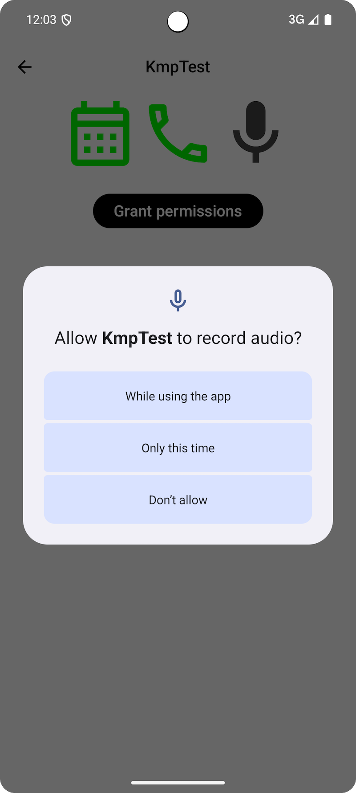
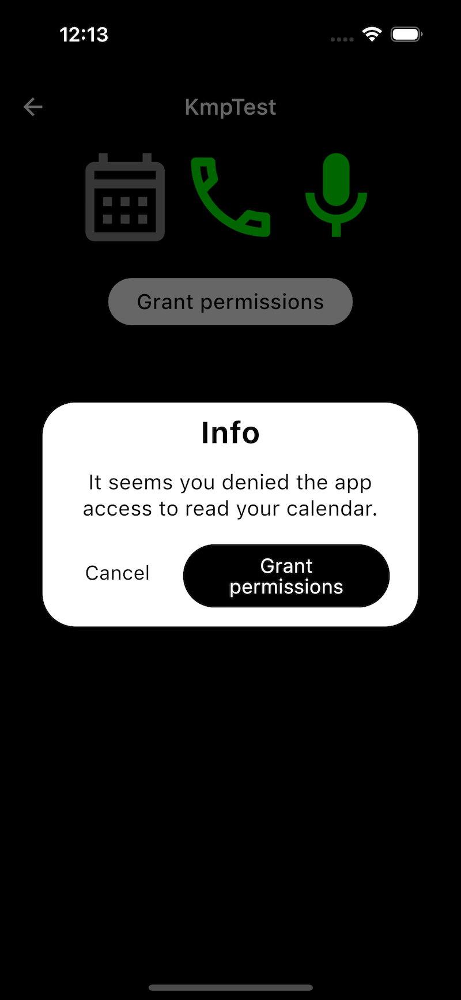
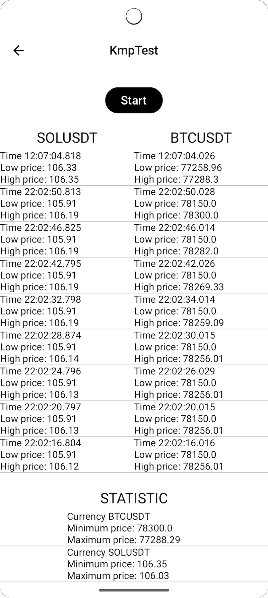
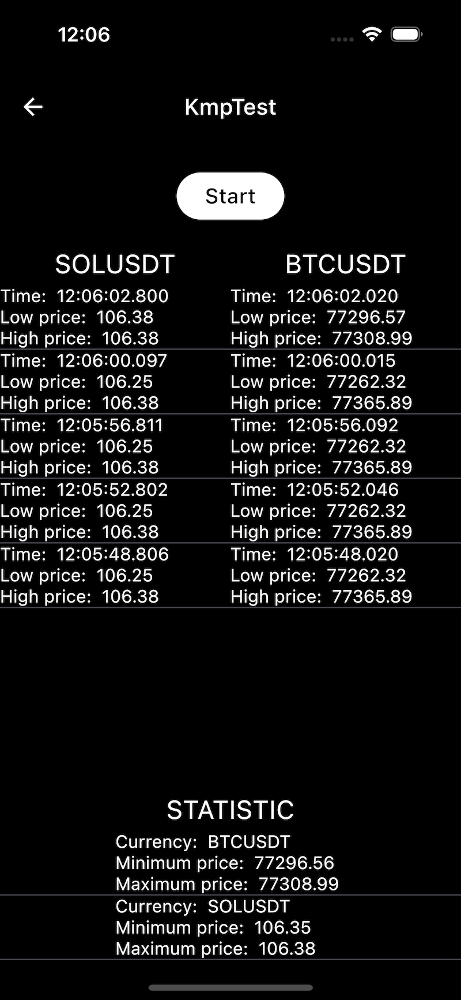

# KMPSamples Project

**KMPSamples** is a **Kotlin Multiplatform** project demonstrating the implementation of **runtime
permission handling**, real-time **cryptocurrency price tracking from the Binance** platform and **video looping**. It is
intended for **educational purposes and for learning programming with KMP**.
The projects use the following features:

- **Material3 Compose**
- **Compose navigation**
- **Compose window size classes**
- **Ktor-client**
- **ViewModel**
- **Room**
- **Koin**
- **Flow**
- **Native iOS AVQueuePlayer + Android ExoPLayer**

### Runtime Permission Handling Sample

| Android                                                                          | iOS                                                                      |
|----------------------------------------------------------------------------------|--------------------------------------------------------------------------|
|  |  |

The first sample showcases the implementation of runtime permission handling for both Android and
iOS platforms:

The `Permission` class contains a rationale message and a message shown when a permission is denied.

Since some permissions make sense to be grouped together (e.g., Read and Write Contacts), the
following classes were created:

- `SinglePermission` – for requesting an individual permission.
- `MultiplePermissions` – for requesting multiple `SinglePermissions` at once.

The `PermissionManager` class, which manages permission handling, works with so-called
`PlatformPermission` classes. This is necessary because on iOS it’s not possible to request
permission groups together. Therefore, `PermissionManager` must either split them into individual
permissions or merge them (e.g., Read and Write Contacts into just Contacts).

So, if you want to request the following permissions in code:

```kotlin
val permissionTypes = listOf(
    PermissionType.MultiplePermissions.create(
        ContactsReadPermission(),
        ContactsWritePermission()
    ),
    SinglePermission(RecordAudioPermission())
)
```

You must first pass them to the `PermissionManager` using the `createPlatformSpecificPermissions`
function, which transforms them into platform-specific permissions:

```kotlin
fun createPlatformSpecificPermissions(permissionTypes: List<PermissionType>): List<PlatformPermissionType>
```

After this step, you can check the state of platform permissions with:

```kotlin
fun checkPermissions(permissionTypes: List<PlatformPermissionType>): List<PermissionState>
```

Or request individual platform permissions using:

```kotlin
fun requestPermission(permissionType: PlatformPermissionType)
```

upon which the manager returns a response for the requested permission type through the function:

```kotlin
fun onPermissionState(onPermissionState: ((PermissionStateType) -> Unit)?)
```

Where:

- `SinglePermissionState` – represents the state of an individual permission, including whether it
  was granted or if a rationale message should be shown.
- `MultiplePermissionState` – holds the states of multiple permissions (`SinglePermissionState`)
  that were requested at the same time.

For easier usage of runtime permission management, a composable helper function was created:

```kotlin
@Composable
fun RequestPermissions(
    requestedPermissionsState: State<RequestedPermissionState>,
    onGrantedPermissions: (permissions: List<Permission>) -> Unit,
    onDeniedPermissions: (permissions: List<Permission>) -> Unit,
)
```

An example of its usage can be found in the `PermissionsScreen`.

#### You can choose the implementation of PermissionManager for iOS:

Using the functions `createPermissionManagerKotlin()` and
`createPermissionManagerNative(nativeInstances)`, you can determine whether to use the Kotlin
interop or the native iOS (Swift) implementation of the PermissionManager.

### Real-time Crypto Price Tracking Sample

| Android                                                                               | iOS                                                                           |
|---------------------------------------------------------------------------------------|-------------------------------------------------------------------------------|
|  |  |

The second project demonstrates how to use `Ktor-client` websockets for real-time cryptocurrency
price tracking.

- The data is stored locally using the `Room` framework.
- It is saved in the database in a `circular buffer style` with a defined capacity.
- Additionally, a `database view` was created to display statistics for individual
  cryptocurrencies.

An example of its usage can be found in the `CryptocurrencyScreen`.

### Video Looping Sample

| Android                                                                     | iOS                                                                 |
|-----------------------------------------------------------------------------|---------------------------------------------------------------------|
|  |  |

The third project demonstrates how to use a native video player in KMP Compose. 
On the `Android side, ExoPlayer` was used and embedded into Compose using `AndroidView`, 
while on the `iOS side, AVQueuePlayer` was used and integrated into Compose via `UIKitView`.

An example of its usage can be found in the `VideoScreen`.

---

To build the release version of an Android app, you need to add your own `keystore.jks` file and
fill in the
following properties in the `keystore.properties` file:

```
storePassword=...
keyPassword=...
keyAlias=...
```